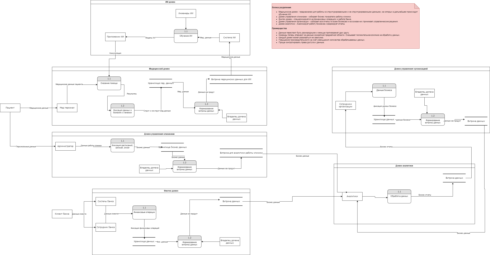
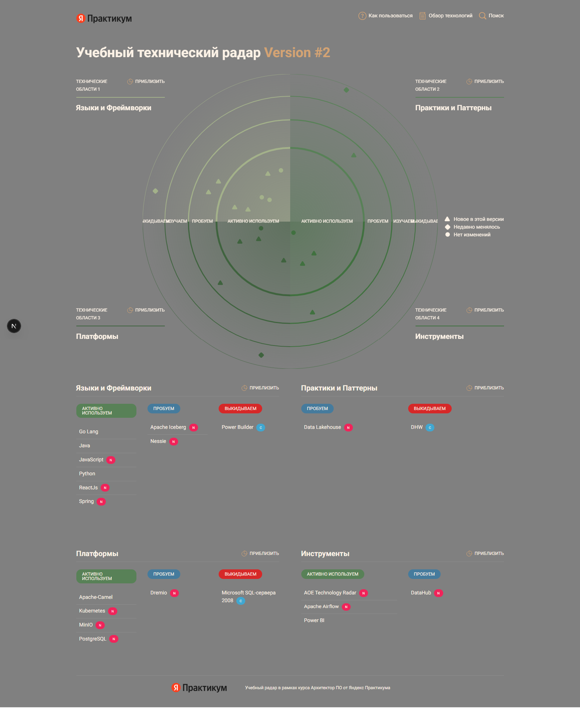

# architecture-future_2_0

## Задание 1

[Архитектура системы через год](Task1/container.drawio)


[Проблемные места и приоритизация](Task1/problems.md)

## Задание 2

[Домены и потоки данных между ними](Task2/dataFlowDiagram.drawio)


## Задание 3

#### Технический радар


Для запуска интерактивной версии:
```shell
cd ./Task3/tech_radar
npm install
npm run serve
```

